# Bedrock Agents

## Product Recommendation Agent
This document outlines the technical configuration and testing procedures for 
a product recommendation agent developed using Amazon Bedrock. The system 
integrates AWS Lambda functions to handle logic and DynamoDB tables to manage 
product inventories and customer shopping carts. By leveraging a Knowledge 
Base stored in an S3 bucket, the assistant provides users with personalised gift
wrapping suggestions through Retrieval-Augmented Generation. During the testing 
phase, the agent demonstrates its ability to filter products by category or occasion, 
manage user identification via email, and suggest related items based on collective 
consumer data. Finally, essential troubleshooting steps are captured to ensure the 
agent functions reliably. 
---

### System Overview and Agent Config :
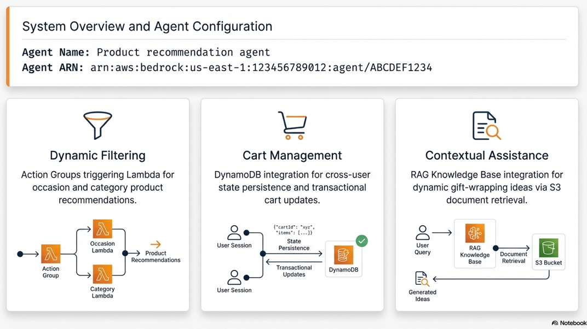

### High Level Serverless Architcture
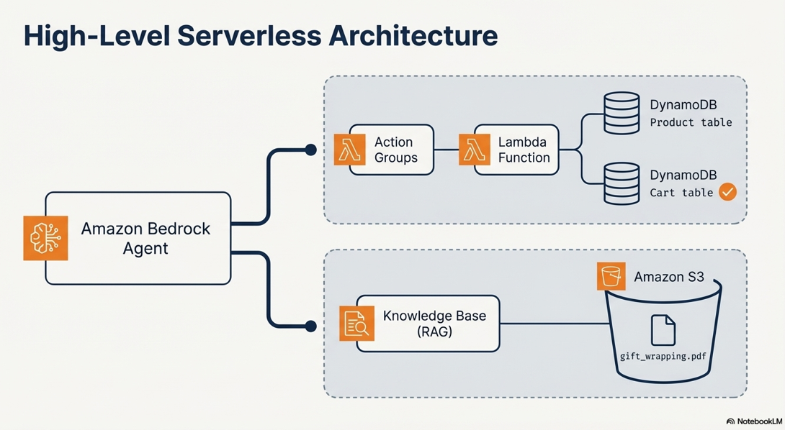

**Features :**
• Dynamic filtering 
• Cart management 
• Contextual Assistance 
---

### 1.Agent Configuration: 

**Agent Name, Agent ARN**

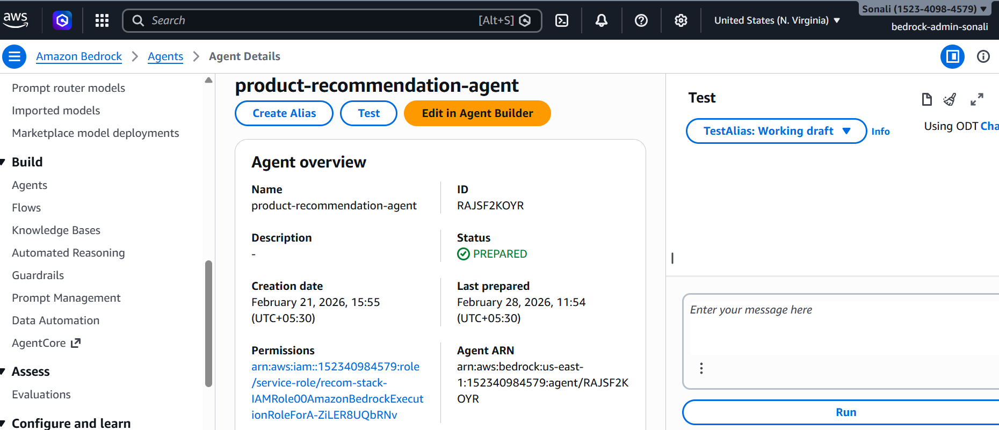

**Action Groups for Lambda call**
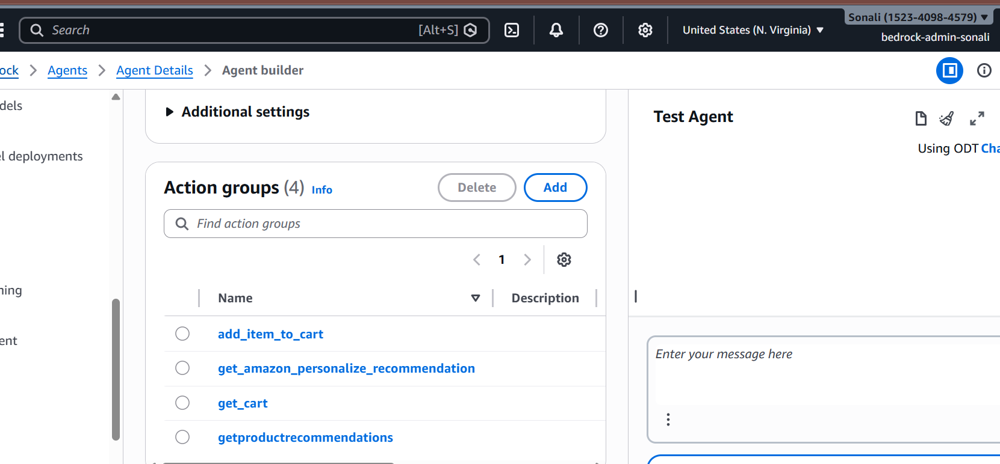

 
**KB for RAG**
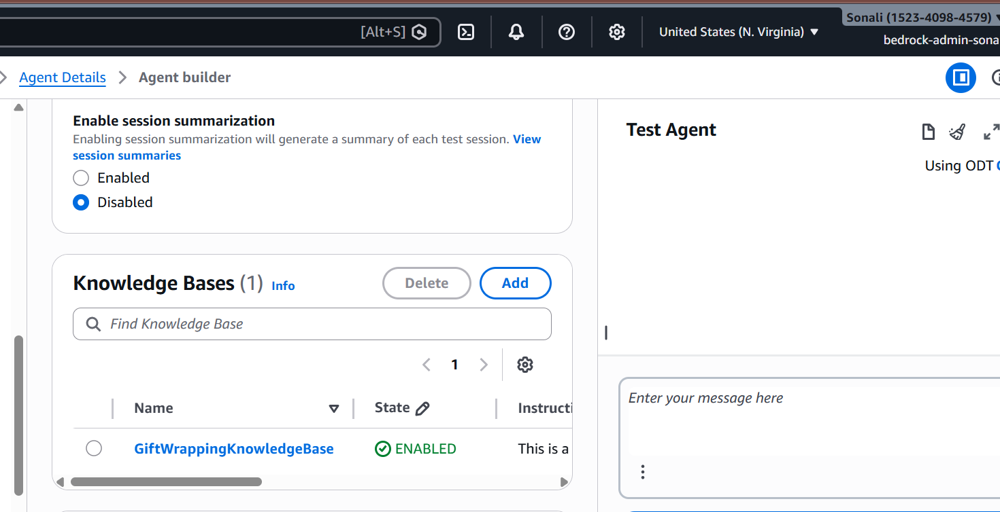

**S3 bucket location for uploaded gift wrapping file**
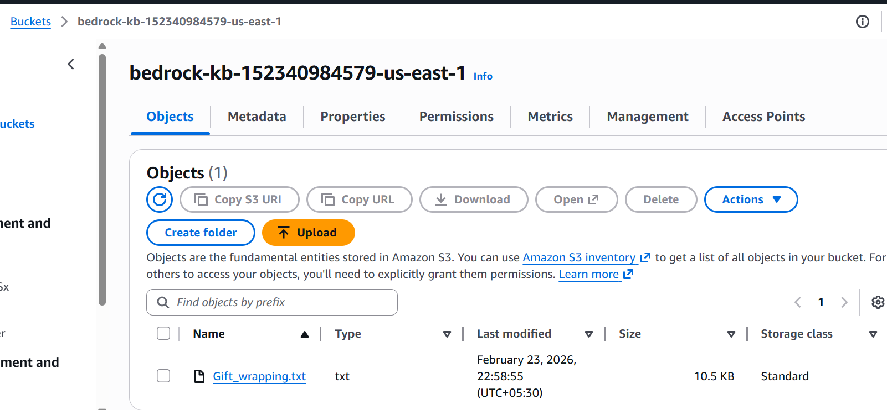

**DynamoDB table**
- Product table
   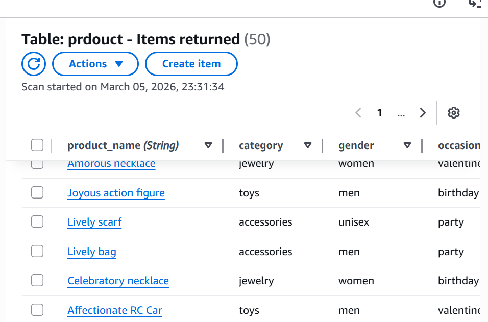

- Cart table
   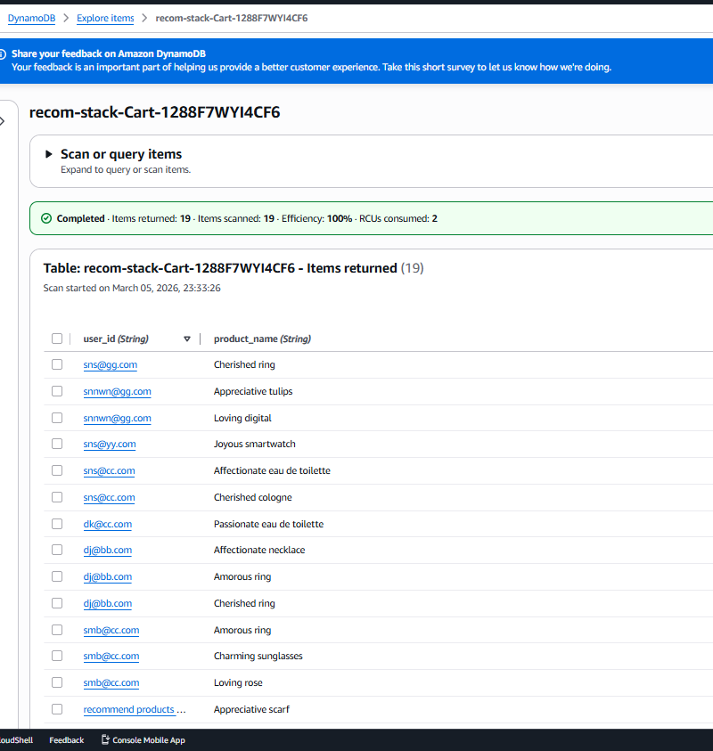 

---

### 2.Tesing the AGent functionality 

---

** Initiating the product discovery flow**
**asks for  filter – occasion or category** 
   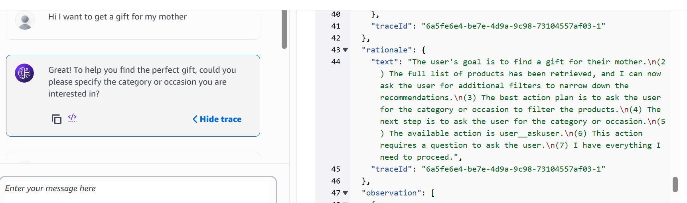

**Parses the occasion parameter and calls the lambda function to generate a tailored 
product recommendation from the database **
   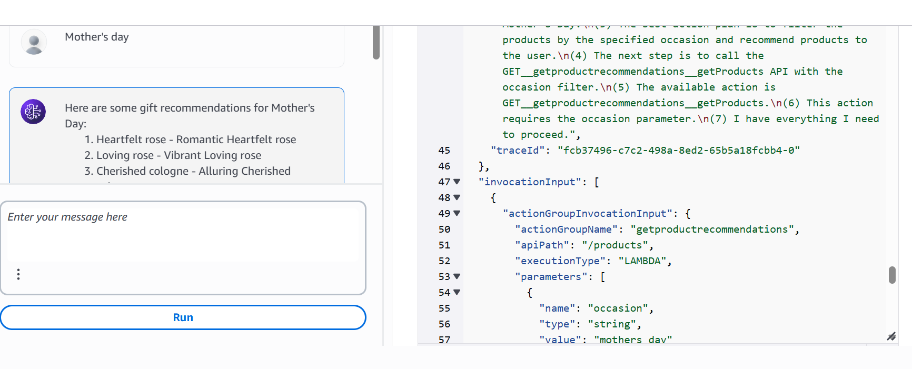

   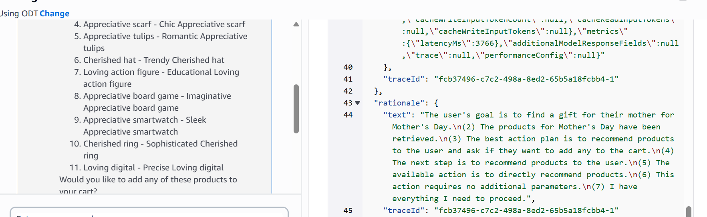

**Establishes User Identity for Cart persistence **
    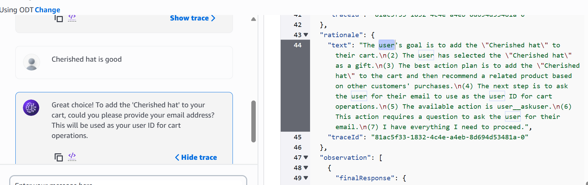

**Recommends a related product after adding the selected product. It shows executing 
cross-user collaborative filtering **

   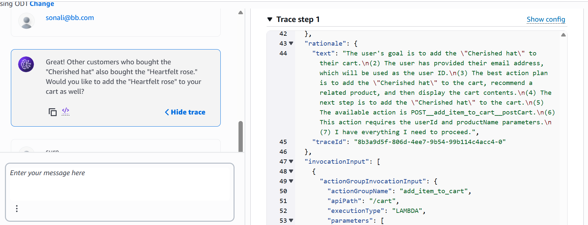

   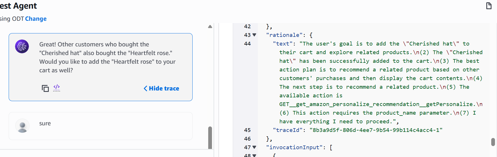

   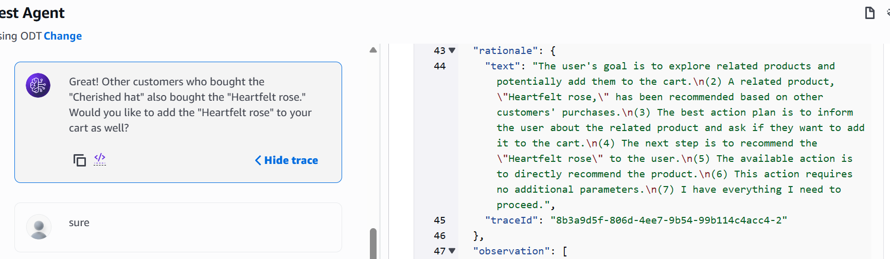

   

(**Finalising Cart additions and displaying State**)

   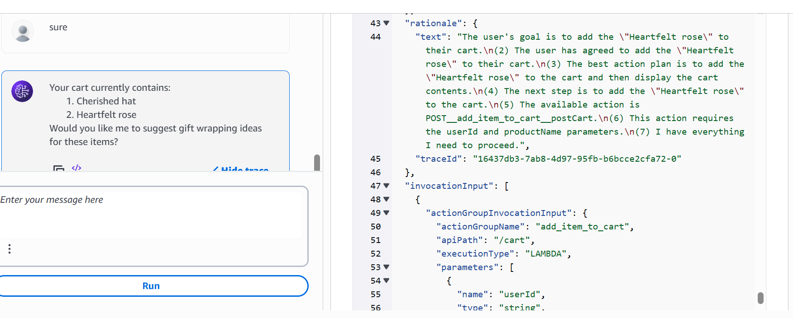

   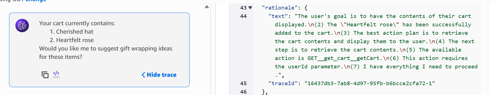

**Enhances the Experience with RAG and Knowledge Bases as it asks about gift wrapping**

   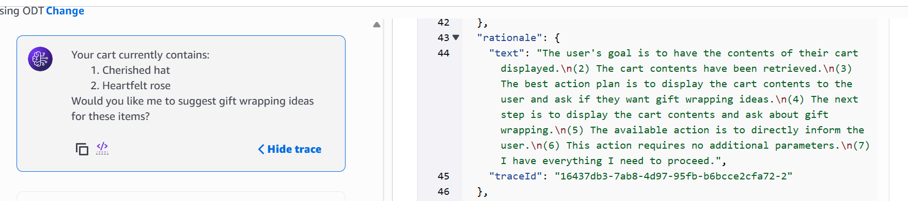
  
**Retrieval from KB which has s3 bucket as Data Source **
    
   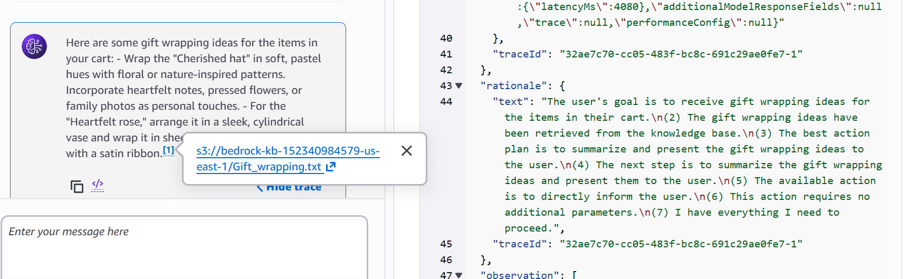
 
 
**Concludes the conversation with a polite message and wishes them**
    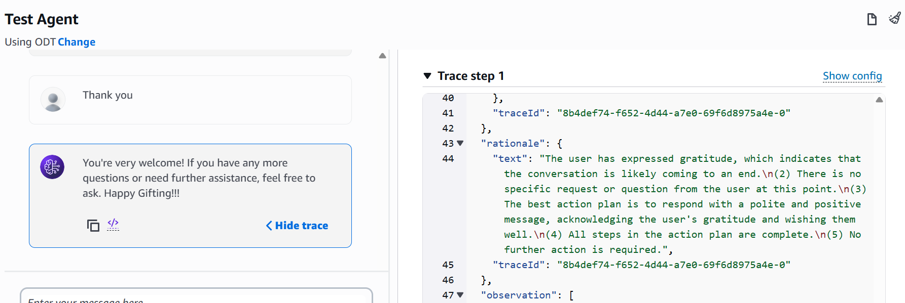

### Verifying the Backend DynamoDB State :

For the current user sonali@bb.com , 2 products are added. To provide personalise 
recommendation, it refers another user’ cart details snn@yy.com 

   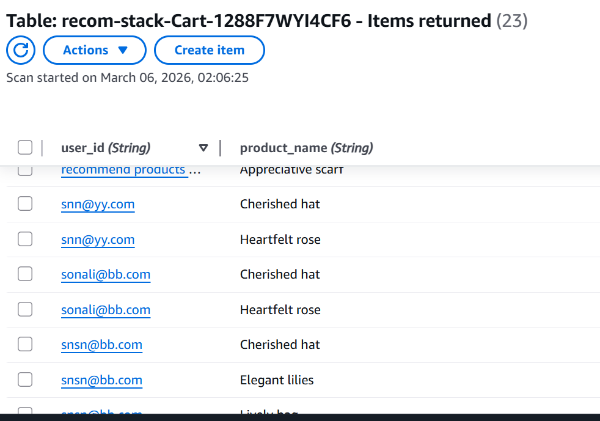
---
### 3.Troubleshooting checklist : 
1) Lambda function permissions to enable the agent to do function call

   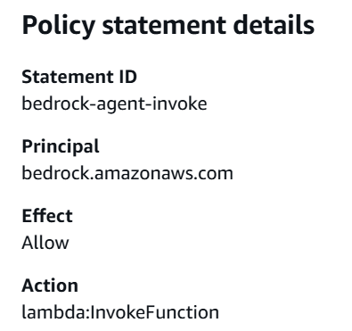

2) Check table name in the lambda function code 
3) IAM user permissions  
4) To Make sure the KB is used to retrieve the information, syncing  the Data Source 
   is important 
   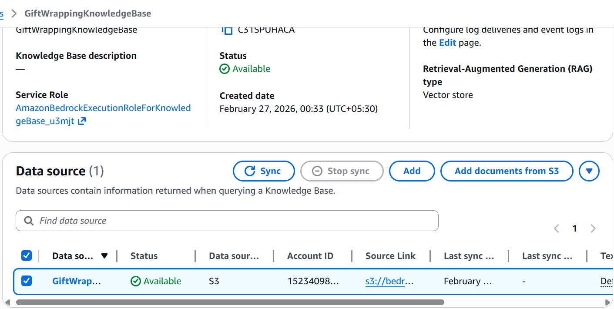 

### 4.Project summary and Technical Outcome :

   
