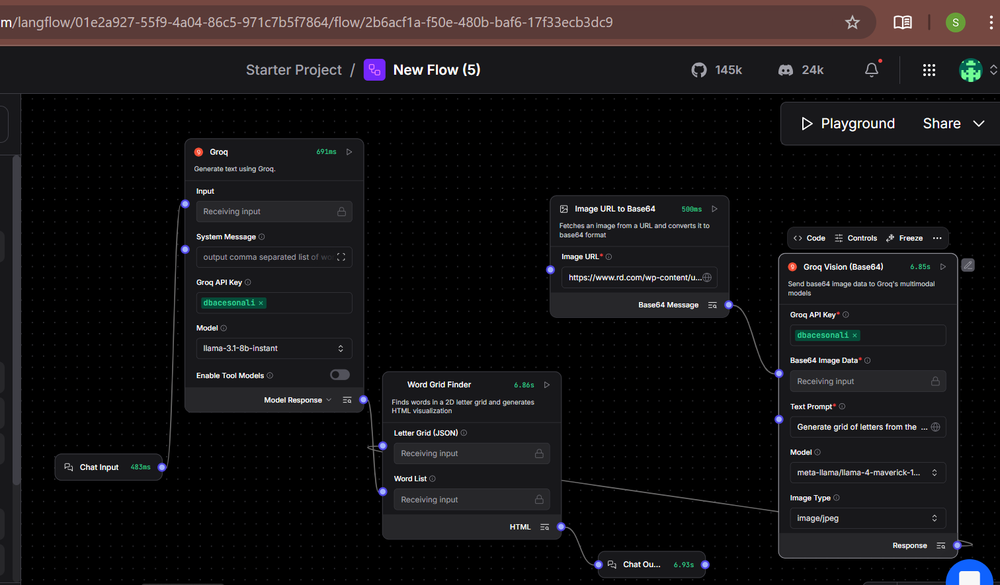
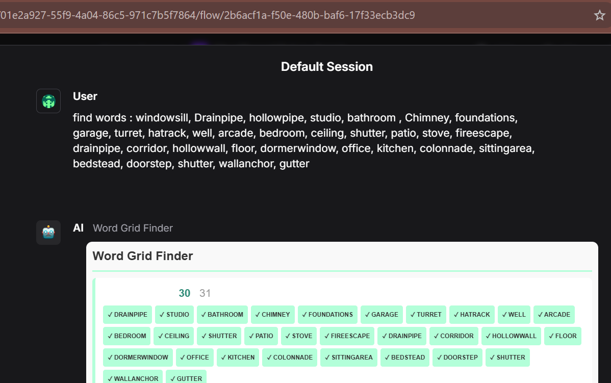
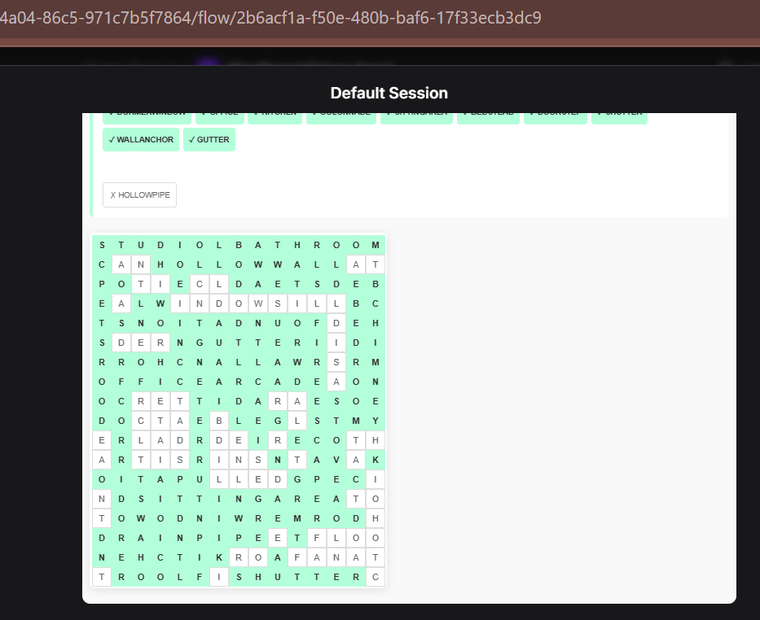

# Multimodal Word Search Solver Agent 🧩
This Langflow flow demonstrates a specialized agentic workflow that combines Multimodal LLMs (Vision) with Custom Python Logic to solve complex visual word search puzzles. It bridges the gap between raw visual data extraction and programmatic algorithmic searching.

# 📝 Description
The Word Search Solver takes an image of a word search puzzle, uses the Llama 3.2 90B Vision model (via Groq) to convert the image into a structured 2D character grid, and then applies a custom search algorithm to find specific words. The final result is a rendered HTML visualization showing exactly where the words are located.

The flow is defined in the  `WordSearchPuzzle-Solver.json` file and visullay represnterd in the  diagram below :

## Input :

## Output:

## 🛠️ Flow structure

* **Image URL to Base64**: Fetches images from web URLs or local paths and prepares them for LLM processing.
* **Groq Vision (Base64)**: A custom component that interfaces with Groq's multimodal models to perform OCR and structured data extraction from images.
* **Groq Model**: Used to process and format the list of words requested by the user.
* **Word Grid Finder**: The core logic engine that performs the 2D search and generates the final HTML output.
* **Chat Input/Output**: Standard Langflow components for user interaction.

## 🧩 How It Works

The flow follows a multi-step process to transform a puzzle image into a solved visualization:

1. **Image Processing**: An image URL is fetched and converted into a Base64 string.
2. **Vision Extraction**: The Base64 image is sent to a **Groq Vision model** (e.g., Llama 3.2 90B Vision) which extracts the characters into a structured 2D JSON array.
3. **Word Input**: The user provides a list of words to find via the Chat Input.
4. **Grid Analysis**: A custom **Word Grid Finder** component searches the extracted 2D grid in all eight directions (horizontal, vertical, and diagonal).
5. **Visualization**: The component generates a responsive HTML table where found words are highlighted in mint green, accompanied by a status list of which words were found or missed.
